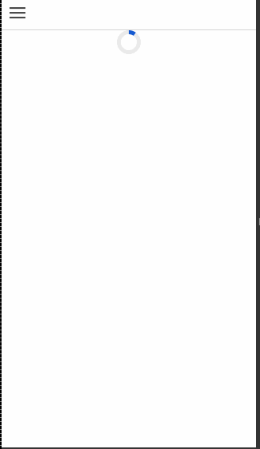
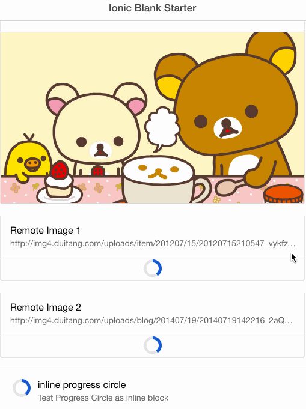

# NOTICE

- I am a little bit rushed with writing 0.5.0, fix several bugs in 0.5.3


- Enhancements in 0.5.0
  - support background image
  - could use your own progress indicator instead of the builtin progress circle
  - the built-in progress circle could be inline-block
  
- Demo and Playground: https://github.com/BenBBear/ionic-cache-src-demo


# ionic-cache-src

Just change `src` to `cache-src`
```html
    

```

and it will take the rest work for you.


## Demo


### simple




### complex




## Install


- bower 

```shell
bower install ionic-cache-src
```

- it depends on [ngStorage](https://github.com/gsklee/ngStorage), [ngCordova](http://ngcordova.com/), [angular-svg-round-progress](https://github.com/crisbeto/angular-svg-round-progressbar) so you have to load them both in you `index.html`


```html
<script src="lib/ngCordova/dist/ng-cordova.min.js"></script>
<script src="cordova.js"></script>
<script src="cordova_plugins.js"></script> <!-- This one is optional -->
<script src="lib/ngstorage/ngStorage.min.js"></script>
<script src="lib/angular-svg-round-progressbar/build/roundProgress.min.js"></script>
<script src="lib/ionic-cache-src/ionic-cache-src.js"></script>
```

- and it use [cordova-plugin-file-transfer](https://github.com/apache/cordova-plugin-file-transfer) and [cordova-plugin-file](https://github.com/apache/cordova-plugin-file), so

```shell
cordova plugin add cordova-plugin-file cordova-plugin-file-transfer
```

- add `ionic-cache-src` to your angular module declaration dependencies

```js
angular.module('myApp', ['ionic','ionic-cache-src'])
```

- Done


## How it Work

very simple strategy


<br>
<br>


## Usage

### Custom the progress circle

it accepts all options for [angular-svg-round-progressbar](https://github.com/crisbeto/angular-svg-round-progressbar) , except for `current`

### Change src

```html

```
will be rendered to

```html

```

not so useful though.


### Background image

```html
<div  cache-src="http://farm4.static.flickr.com/3131/2877192571_3eb8bcf431.jpg"
src-is="background" >
<!-- stuff -->
</div>
```

#### Custom background style

```html
<div  cache-src="http://farm4.static.flickr.com/3131/2877192571_3eb8bcf431.jpg"
src-is="background"
background-style="no-repeat center"
background-loading-style="url('path/to/your/loading/image.gif') no-repeat center"
>
<!-- stuff -->
</div>
```
- `background-style` will be used as

```html
<div style="background:url('image/url') {{backgroundStyle}}">
<!-- stuff -->
</div>
```

- Default `background-loading-style` is `url('lib/ionic-cache-src/img/loader.gif') no-repeat center`


### Inline progress circle

By default the progress circle is a block div, here is source code.

```js
function makeProgressCircle($scope, $compile) {
    return angular.element($compile('<div style="{{circleContainerStyle}}"><div round-progress  max="max"  current="progress"  color="{{color}}" bgcolor="{{bgcolor}}"  radius="{{radius}}"  stroke="{{stroke}}"  rounded="rounded" clockwise="clockwise" iterations="{{iterations}}"  animation="{{animation}}"></div></div>')($scope));
};
```

So you could change its style using `circleContainerStyle`

```html
<div class="list">
    <a class="item item-avatar" href="#">
        
        <h2>inline progress circle</h2>
        <p>Test Progress Circle as inline block</p>
    </a>
</div>
```


### Callback

```html

```

```js
function onError(err){}
function onStart(originUrl){}
function onFinish(naiveUrl){}
function onProgress(number){}
```

Note that the `OnProgress` and `OnStart` will only be called if a download is needed.

### Work in broswer

It will works in browser with a mock download process.


### For local file path

> The plugin will download and cache the file if the url is `http`, `https` or `ftp`, otherwise it won't.

So it works for local file path, or base64 etc...


### Service

This plugin store cache info as  `$localstorage.cache_src = {RemoteUrl:LocalUrl}`, and there is a factory defined:

```js
    module.factory('cacheSrcStorage', function($localStorage) {
        var c = {};
        c._cache = $localStorage.cache_src;
        c.get = function(url){
            return c._cache[url] && (getCacheDir() + c._cache[url]);
        };
        c.set = function(url,localUrl){
            c._cache[url] = localUrl;
            return c;
        };
        return c;
    });
```
which you can use to access the cached file


### Config

```js
module.config(function($cacheSrcProvider){
    $cacheSrcProvider
              .set('key',value)
              .set({key:value}); // set option
})

```
Key, Value for options like

- `srcIs` 
- `onError` for global use etc...
- `showProgressCircleInBrowser` whether show progress circle in browser
- `showProgressCircleInDevice` whether show progress circle in device
- `interval` browser mock progress circle period, by default 200.
-  options for progress circle  [angular-svg-round-progressbar](https://github.com/crisbeto/angular-svg-round-progressbar)

- `backgroundStyle` and `backgroundLoadingStyle`
- `circleContainerStyle`
- Anything you like, if you use custom progress indicator.

Note that the in-tag config has the higher priority than  `$cacheSrcProvider`


### Use custom progress indicator instead of built-in progress circle

Use callback

```
uiOnStart, uiOnProgress, uiOnFinish
```

Here is the default source of this three functions, which implements the progress circle. Take it as reference and write your own.

```js
    var default_config = {
        interval: 200,
        backgroundStyle:'',
        backgroundLoadingStyle:"url('lib/ionic-cache-src/img/loader.gif') no-repeat center",
        uiOnStart:uiOnStart,
        uiOnFinish:uiOnFinish,
        uiOnProgress:uiOnProgress
    };

    function makeProgressCircle($scope, $compile) {
        return angular.element($compile('<div style="{{circleContainerStyle}}"><div round-progress  max="max"  current="progress"  color="{{color}}" bgcolor="{{bgcolor}}"  radius="{{radius}}"  stroke="{{stroke}}"  rounded="rounded" clockwise="clockwise" iterations="{{iterations}}"  animation="{{animation}}"></div></div>')($scope));
    };

    var uiOnProgress = function(scope, element, $compile, uiData) {
        scope.progress = uiData.progress;
    };
    var uiOnStart = function(scope, element, $compile, uiData) {
        if (scope.srcIs == 'background') {
            element[0].style.background = scope.backgroundLoadingStyle;
        } else {
            extend(scope, default_circle_style);
            var progress_circle;

            function addCircle() {
                progress_circle = makeProgressCircle(scope, $compile);
                uiData.display = element.css('display');
                element.css('display', 'none');
                element.after(progress_circle);
            };

            if (window.cordova) {
                if (scope.showProgressCircleInDevice) {
                    addCircle();
                }
            } else {
                if (scope.showProgressCircleInBrowser) {
                    addCircle();
                }
            }
            uiData.progress_circle = progress_circle;
        }
    };
    var uiOnFinish = function(scope, element, $compile, uiData) {
        if (scope.srcIs != 'background') {
            function rmCircle() {
                element.css('display', uiData.display);
                uiData.progress_circle.remove();
            }
            if (window.cordova) {
                if (scope.showProgressCircleInDevice) {
                    rmCircle();
                }
            } else {
                if (scope.showProgressCircleInBrowser) {
                    rmCircle();
                }
            }
        }
    };
```

To use your own uiOn* functions

```js
module.config(function($cacheSrcProvider){
    $cacheSrcProvider
              .set('uiOnStart', myUiOnStart)
              .set('uiOnProgress', myUiOnProgress)
              .set('uiOnFinish', myUiOnFinish);
}); 
```


<br>
<br>
<br>


## Attention


### cordova_plugins.js

Because of https://github.com/driftyco/ionic-plugin-keyboard/issues/82 , the `ionicPlatform.ready` may fail from exception. If you encounter this problem, Add 

```html
<script src="cordova_plugins.js"></script>
```

solve it.


#### livereload

> When using live reload, you’re actually running the assets off the computer and not the device

You will get an error: `Not allowed to load local resource`, but it will only occur when livereloading.
